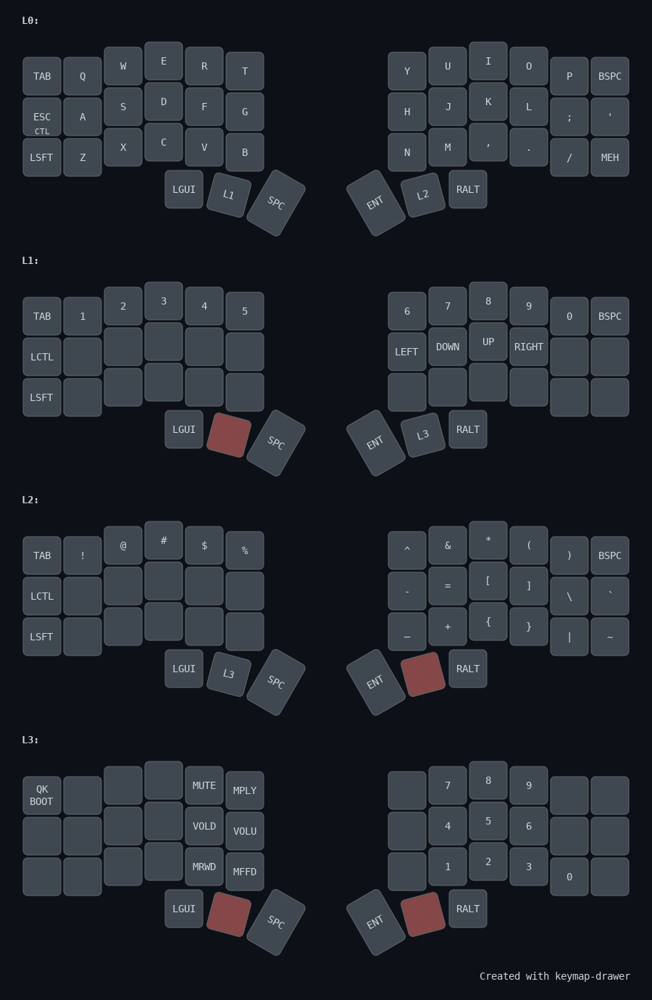

# Corne Keyboard (CRKBD)




A split keyboard with 3x6 vertically staggered keys and 3 thumb keys.

Keyboard Maintainer: [foostan](https://github.com/foostan/) [@foostan](https://twitter.com/foostan)  
Hardware Supported: Crkbd PCB, Pro Micro  
Hardware Availability: [PCB & Case Data](https://github.com/foostan/crkbd)

Make example for this keyboard (after setting up your build environment):

```sh
make crkbd:default
```

See the [build environment setup](https://docs.qmk.fm/#/getting_started_build_tools) and the [make instructions](https://docs.qmk.fm/#/getting_started_make_guide) for more information. Brand new to QMK? Start with our [Complete Newbs Guide](https://docs.qmk.fm/#/newbs).
